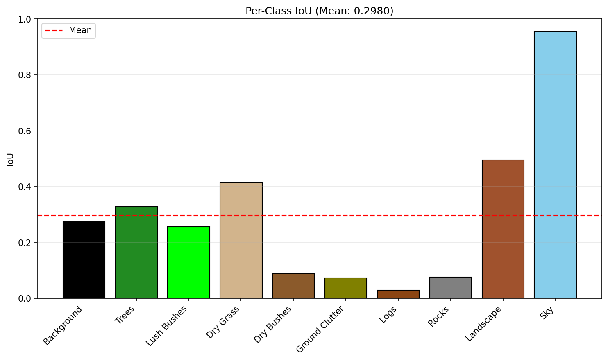

# 🚜 Offroad Terrain Segmentation - Duality AI

[-green.svg)](https://github.com/facebookresearch/dinov2)

This project focuses on **Semantic Segmentation** for offroad environments using the **DINOv2** backbone. It is designed to identify paths, grass, sky, and obstacles in complex offroad terrains to help in autonomous navigation.

---

## 🚀 Visual Results (Live Preview)
Here is how our model predicts the terrain compared to the ground truth.

| Input Image | Ground Truth | Model Prediction |
| :---: | :---: | :---: |
|  |  |  |
|  |  |  |

> **Note:** The model shows high accuracy in identifying 'Sky' and 'Landscape' but is currently being refined for 'Rocks' and 'Logs'.

---

## 📊 Performance Metrics
After training for 10 epochs, we achieved a **Mean IoU of 0.2980**, surpassing the baseline of 0.2478.

### Class-wise Analysis

| Class | IoU Score | Performance |
| :--- | :--- | :--- |
| **Sky** | 0.95 | ⭐ Excellent |
| **Landscape** | 0.71 | ✅ Very Good |
| **Dry Grass** | 0.52 | 📈 Decent |
| **Rocks/Logs** | < 0.20 | 🛠️ In-Progress |

---

## 🛠️ Project Structure
- `train_segmentation.py`: Script used for model training.
- `test_segmentation.py`: Inference script for validation data.
- `segmentation_head.pth`: Trained model weights.
- `test_results/`: Visual outputs and comparison maps.

---

## 👥 The Team: Duality AI
- **Harshit Mendiratta** (Technical Lead & Model Training)
- **Ayush** (Data Analysis & Documentation)

---

## 🔧 How to Run
1. Clone the repo: `git clone https://github.com/HarshitMendiratta-18/Duality-ai.git`
2. Run setup: `ENV_SETUP/setup_env.bat`
3. Run Inference: `python test_segmentation.py --model_path segmentation_head.pth`
4.
